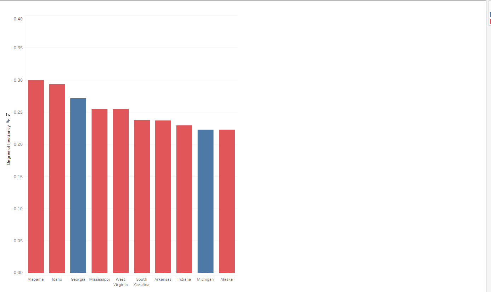
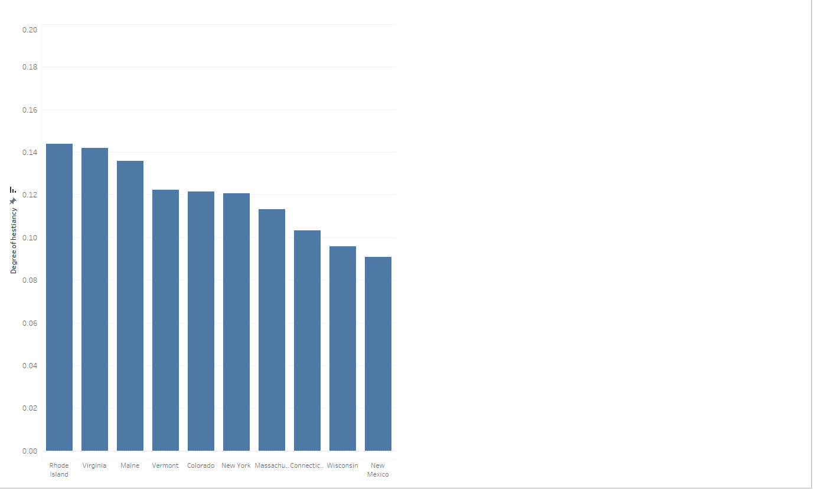
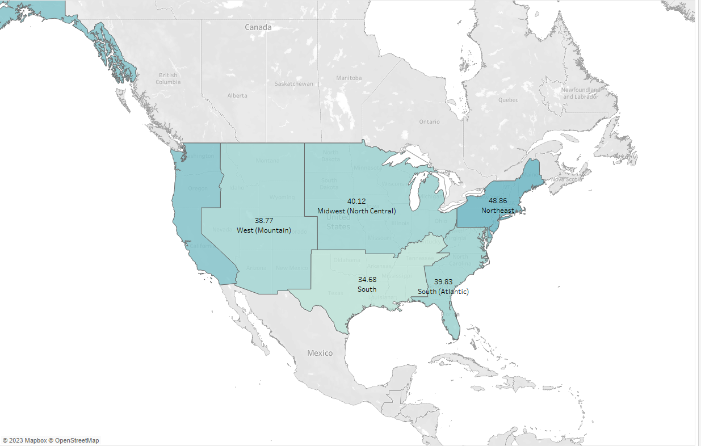

# Visualizing COVID-19 Vaccination Patterns in the US using Tableau

In this project, I utilized Tableau to create insightful visualizations of COVID-19 vaccination patterns in the United States. Leveraging data from the CDC website, I aimed to provide a comprehensive understanding of vaccination trends based on diverse criteria, including state-wise distribution and vaccination progress over time.

## Key Achievements:

- **Data Collection and Preprocessing:**
  - Collected COVID-19 vaccination data from the CDC website, ensuring data accuracy and completeness.
  - Preprocessed the data in R, utilizing time series imputation methods to handle missing values. This step was crucial for maintaining the integrity of the visualizations.

- **Tableau Visualizations:**
  - Developed a series of interactive dashboards using Tableau to showcase vaccination patterns. These dashboards enable users to explore the data dynamically, gaining insights into state-level variations and temporal trends.
 

- **Exploratory Data Analysis:**
  - Conducted exploratory data analysis within Tableau, uncovering key patterns and correlations. This involved analyzing vaccination rates, identifying hotspots, and assessing the impact of vaccination campaigns.
 
    - Understanding the corrleation between vaccine hesitancy and political influence

      

         <!-- Adding line breaks for spacing -->
   
      

         <!-- Adding line breaks for spacing -->

    - Vaccination status by different status as of December 2021

      
      

- **Effect Exploration:**
  - Explored the effects of various factors, including political influences, weather conditions, time, and state-specific dynamics, on vaccination patterns.

- **Storytelling through Data Visualization:**
  - Crafted a compelling narrative by arranging visualizations into a cohesive story. This approach enhances the communicative power of the project, making complex vaccination data more accessible to a broad audience.

- **User Interaction Features:**
  - Implemented features for user interaction within Tableau, allowing viewers to filter and drill down into specific aspects of the data. This enhances the overall user experience and facilitates deeper exploration.

This project not only demonstrates my proficiency in data visualization but also showcases my ability to extract meaningful insights from complex datasets, contributing to a better understanding of COVID-19 vaccination trends in the US.
